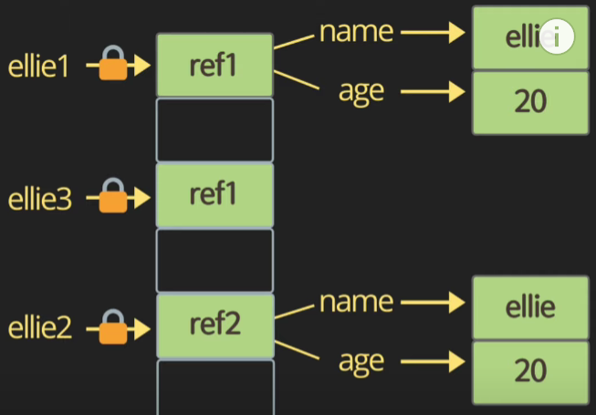

# String concatenation

```javascript
console.log('my' + 'cat');
console.log('1'+2);
console.log('string literals: '''' 1+2=${1+2}');
console.log('ellie\'s \n book')
```

# Numeric operators

```javascript
console.log(1 + 1); //add
console.log(1 - 1); //substract
console.log(1 / 1); //divide
console.log(1 * 1); //multiply
console.log(5 % 2); //remainder
console.log(2 ** 3); //exponentiation
```

# Increment and decrement operators

```javascript
let counter = 2;
const preIncrement = ++counter;
//counter=counter+1;
//preIncrement=counter;

const postIncrement = counter++;
//preIncrement=counter
//counter=counter+1

const preDecrement = counter--;

const postDecrement = --counter;
```

# Assignment operators

```javascript
let x = 3;
let y = 4;
x += y;
x -= y;
x *= y;
x /= y;
```

# Comparison operators

```javascript
console.log(10 < 6);
console.log(10 <= 6);
console.log(10 > 6);
console.log(10 >= 6);
```

# Logical operators: || (or) && (and), ! (not)

```javascript
const value1=true;
const value2=4<2;

console.log (value1||value2||check());

console.log (value1&&value2&&check());
//or과 and 모두 check와 같은 heavy한 operation을 뒤에 배치해야 효율이 좋다.
function check() {
    for (let i=0 i<10; i++){
        console.log('wasting time')
    }
    return true
}
//not은 !이다.
//!True는 False와 같다.
```

# Equality

```javascript
const stringFive = "5";
const numberFive = 5;

//== loose equlity, with type conversion
console.log(stringFive == numberFive); //True
console.log(stringFive != numberFive); //False

//=== strict equality, no type conversion
console.log(stringFive === numberFive);
console.log(stringFive !== numberFive);

//object equality by reference
const ellie1 = { name: "ellie" };
const ellie2 = { name: "ellie" };
const ellie3 = ellie1;
console.log(ellie1 == ellie2); //False
console.log(ellie1 === ellie2); //False
console.log(ellie1 === ellie3); //True
```

<br>참고

# equality-puzzler

```javascript
console.log(0 == false); //True
console.log(0 === false); //False
console.log("" == false); //True
console.log("" === false); //False
console.log(null == undefined); //True
console.log(null === undefined); //False
//type에 집중하면 답이 보인다
```

8. # Conditional operators: if
   if, else, else if

```javascript
const name='df';
if (name==='ellie'){
    console.log('Welcome, Ellie!');
}else if (name===''coder) {
    console.log('boo')
} else {
    console.log('unknown')
}
```

9. # Ternary operator:?

```javascript
condition ? value1 : value2;
//만약 condition이 true이면 value1이, false이면 value2가 선택된다.
let name = "ellie";
console.log(name === "ellie" ? "yes" : "no"); //yes
```

10. # Switch statement
    use for multiple if checks
    use for enum-like value check
    use for multiple type checks in TS

```javascript
const browser = "IE";
switch (browser) {
  case "IE":
    console.log("go away!");
    break;
  case "Chrome":
  case "FireFox":
    console.log("love you!");
    break;
  default:
    console.log("same all!");
    break;
}
```

11. # Loops
    while loop, while the condition is truthy, body code is executed.

```javascript
let i = 3;
while (i > 0) {
  console.log("while:${i}");
  i--;
}
// while:3 while:2 while:1 <-출력결과
```

do while loop, body code is executed first,then check the condition.

```javascript
do {
  console.log("do while: ${i}");
  i--;
} while (i > 0);
//while:0 <-출력결과
```

for loop, for(begin; condition; step)

```javascript
for (i = 3; i > 0; i--) {
  console.log("for:${i}");
}
//for:3 for:2 for:1

for (let i = 3; i > 0; i = i - 2) {
  //incline variable declaration
  console.log("inline variable for: ${i}");
}
```

nested loops

```javascript
for (let i = 0; i < 10; i++) {
  for (let j = 0; j < 10; j++) {
    console.log("i:${i}, j:${j}");
  }
}
```

break, continue

```javascript
for (let i=0; i<=10, i++){
    if (i%2===0){
        continue;
    }
    console.log(i)
}
```

```javascript
for (let i = 0; i <= 10; i++) {
  if (i % 2 === 1) {
    continue;
  }
  console.log(i);
}
```

```javascript
for (let i = 0; i <= 10; i++) {
  if (i > 8) {
    break;
  }
  console.log(i);
}
```
